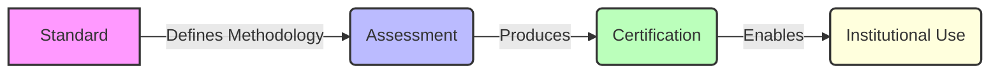

title: Certification
---

# Certification

Certification is the mechanism that allows governance to be relied upon.

Governance that has been designed, implemented, and documented is not sufficient on its own.
It must be expressed in a form that institutions can use without reconstructing the assessment themselves.

Certification performs that function.

---

## Certification as a reliance mechanism

Certification allows governance posture to move across institutional boundaries:

* Boards rely on it for oversight
* Insurers rely on it for underwriting
* Investors rely on it for diligence
* Regulators rely on it for supervision

Without certification, governance remains internal.
With certification, governance becomes a market signal.

---

## What Certification Does

ARAF certification performs three functions.

### 1. Information Compression

Certification compresses a full governance assessment into a form that institutional audiences can use without reproducing the methodology.

The underlying assessment evaluates governance posture across six dimensions:

* Autonomy Gradient
* Data Sensitivity Exposure
* Contract Infrastructure
* Liability Architecture
* Commercial Leverage
* Adaptive Stability 

The output is expressed through:

* Governance Benchmark Index (GBI) score 
* dimensional profile
* multiplier status
* certification tier

The dimensional profile produces actionability.
The certification signal produces comparability.

---

### 2. Accountability Transfer

Certification is not a claim by the organisation.

It is a representation by an **independent accredited assessor** operating under a defined methodology.

When certification is issued:

* the assessor accepts professional accountability for the assessment
* the methodology is publicly reviewable
* the output becomes institutionally usable

This transfer of accountability is what gives the signal credibility.

---

### 3. Market Formation

Certification makes governance posture:

* comparable
* assessable
* priceable

Without comparability, governance cannot be priced.
Without pricing, governance investment cannot produce a return.

This pattern is consistent across institutional infrastructure:

* credit ratings in debt markets
* ISO certification in procurement
* PCI DSS in payment networks

ARAF certification performs the same function for autonomous system governance.

---

## Certification Tiers

Certification is anchored in the Governance Benchmark Index (GBI).

Lower scores indicate stronger governance posture. 

| Tier               | Threshold  | Institutional Meaning                                                                                  |
| ------------------ | ---------- | ------------------------------------------------------------------------------------------------------ |

| **ARAF Assessed**  | No minimum | Governance posture independently evaluated. Entry point for institutional review. → usable for internal understanding only |
| **ARAF Compliant** | GBI ≤ 2.50 | Minimum institutional threshold. Supports standard insurance, procurement, and regulatory engagement. → usable for institutional engagement |
| **ARAF Certified** | GBI ≤ 1.75 | Full institutional reliance. Supports classification, insurance, financing, and board-level assurance. → usable for full institutional reliance |

These are not labels.

They are **decision thresholds** used by:

* boards (oversight adequacy)
* insurers (coverage and pricing)
* investors (risk discount vs governance asset)
* regulators (comparability across entities)

import CertificationInfrastructureBlock from "../../../components/CertificationInfrastructureBlock.astro"

<CertificationInfrastructureBlock />

## Certification as Infrastructure

Certification is the **signal layer** of the ARAF system.

The architecture separates four functions:

| Layer             | Function                                                  |
| ----------------- | --------------------------------------------------------- |
| **Standard**      | Defines methodology (dimensions, scoring, evidence)       |
| **Assessment**    | Applies methodology to a specific deployment              |
| **Certification** | Issues a comparable institutional signal                  |
| **Reliance**      | Boards, insurers, investors, regulators act on the signal |

This separation is structural.

* the standard defines
* assessors evaluate
* certification communicates
* institutions rely

No single actor controls the full chain.

This is what allows certification to function as **market infrastructure rather than self-reported governance**.

---

## Certification as Infrastructure — Diagram

*This diagram shows the separation between standard, assessment, certification, and institutional use, reinforcing the infrastructure logic.*

---

## Assessor Accreditation

Certification is only as credible as the assessors who produce it.

Accredited assessors must demonstrate:

### 1. Methodological Competence

Ability to apply:

* six-dimensional assessment
* multiplier logic 
* GBI scoring
* evidentiary standards

---

### 2. Methodology Adherence

Assessments must follow the published ARAF methodology.

The methodology is open (CC BY 4.0), allowing independent scrutiny.

---

### 3. Independence

Assessors must be structurally independent of the organisation being assessed.

Advisory and assessment functions must be separated:

* different personnel
* separate engagements
* documented independence controls

Self-certification does not satisfy this requirement.

---

### 4. Accountability

Assessors are accountable for assessment quality.

Accreditation may be withdrawn where:

* methodology is not followed
* independence is compromised
* assessment quality is deficient

---

## Certification Lifecycle

Autonomous systems evolve continuously.

Certification therefore operates within a defined validity structure.

### Initial Assessment

Produces:

* GBI score
* full dimensional profile
* multiplier analysis
* evidence quality assessment
* remediation roadmap
* certification tier

---

### Scheduled Reassessment

Maximum interval: 12 months

Confirms that governance posture has been maintained.

---

### Event-Triggered Reassessment

Triggered by material changes, including:

* model updates
* new deployment contexts
* changes to data sources
* changes to contract infrastructure
* anomaly patterns or governance drift
* regulatory developments
* adverse outcomes
* **government actions affecting the decision supply chain**

(see Decision Supply Chain governance requirements )

---

### Certification Withdrawal

Certification may be withdrawn where:

* governance deteriorates below threshold
* material changes are not disclosed
* assessment inputs were inaccurate
* evidence quality is insufficient

---

## Evidence and Certification

Certification reflects governance posture.

Evidence determines **confidence in that posture**.

ARAF distinguishes three evidence tiers:

* **Tier 1 — Infrastructure-generated** (highest confidence)
* **Tier 2 — Contemporaneous documentation**
* **Tier 3 — Reconstructed documentation** 

Two systems with identical GBI scores may not carry the same institutional weight if their evidence differs.

Certification must therefore be read alongside:

* evidence quality
* dimensional profile
* multiplier status

---

## Certification and Institutional Reliance

Certification does not create a safe harbour.

It creates **defensible position**.

An organisation holding ARAF Compliant or Certified status has:

* contemporaneous evidence
* independent assessment
* defined methodology alignment

This is the type of evidence:

* courts consider in standard of care
* insurers rely on in underwriting
* regulators consider in supervision
* boards rely on in oversight

Certification does not eliminate risk.
It determines **how that risk is interpreted after the fact**.

---

## Relationship to Standard Governance

The ARAF standard defines the methodology.

Certification operates independently of the standard maintainer. 

This separation ensures:

* methodological stability
* assessment independence
* institutional credibility

The standard produces the rules.
Certification produces the signal.

---

## Why Certification Exists

The market is not waiting for perfect governance.

It is waiting for **measurable, comparable governance**.

Certification is the mechanism that allows governance quality to:

* move between organisations
* be priced by insurers
* be evaluated by investors
* be relied upon by boards

Without certification, governance remains internal.
With certification, governance becomes **infrastructure**.

---

## Citation

Martin, Carly.
*Agentic Risk Architecture Framework (ARAF), Version 3.0.*
Venture Bench Pty Ltd, 2026.

---

<!--
WHAT THIS FIX DOES

This version:

### 1. Aligns with Standard Governance page

* explicit **separation of powers**
* removes any implication of central control

### 2. Positions certification correctly

* not output → **infrastructure layer**
* not badge → **decision signal**

### 3. Strengthens institutional credibility

* clearer accountability transfer
* stronger independence framing
* explicit lifecycle validity logic

### 4. Fixes structural clarity

* adds **4-layer architecture (Standard → Assessment → Certification → Reliance)**
* ties directly to:
	* GBI 
	* Dimensions 
	* Multiplier Logic 
	* Decision Supply Chain 
-->